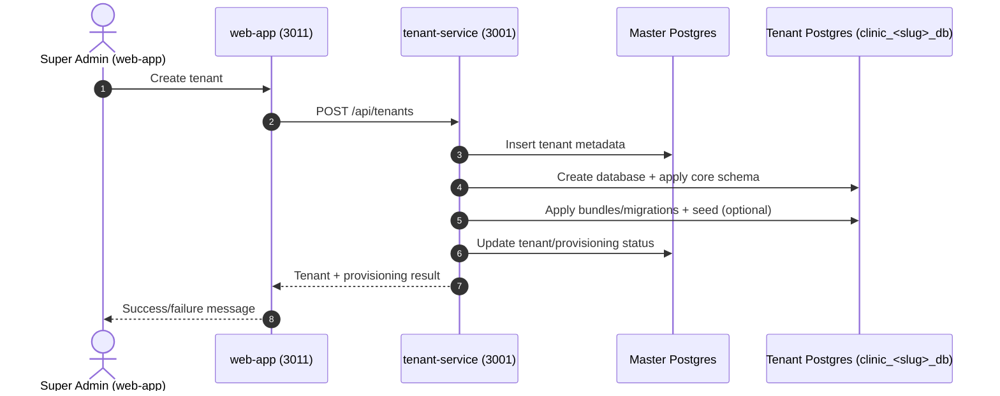
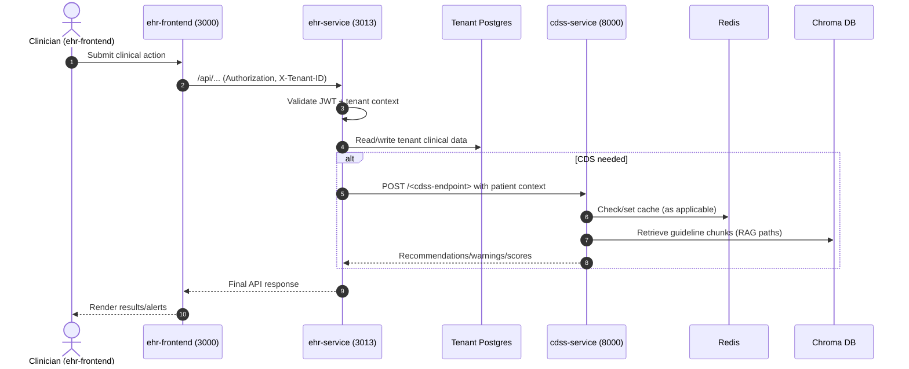
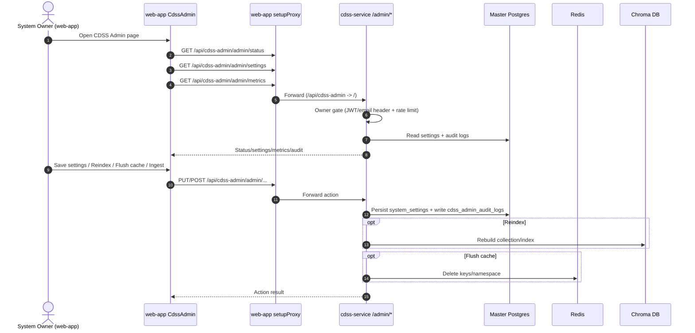
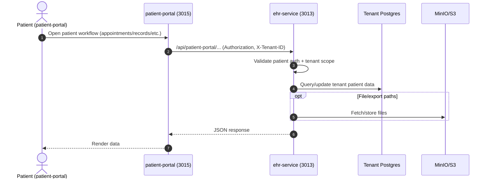

# Request/Data Flows

This document provides sequence diagrams for the main runtime paths across MediCore services.

## 1) Tenant Provisioning

## 2) Clinical Action + CDSS

## 3) CDSS Admin (Owner)

## 4) Patient Portal

## Notes

- Primary tenant routing header: `X-Tenant-ID`.
- Auth header: `Authorization: Bearer <token>`.
- Super-admin UI proxy mappings are defined in `web-app/src/setupProxy.js`.
- CDSS admin settings are persisted in master DB tables:
  - `system_settings`
  - `cdss_admin_audit_logs`
